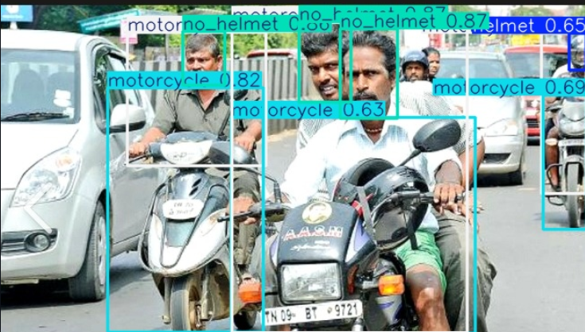
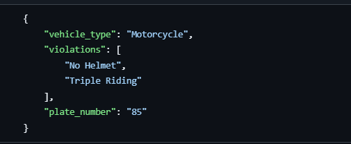
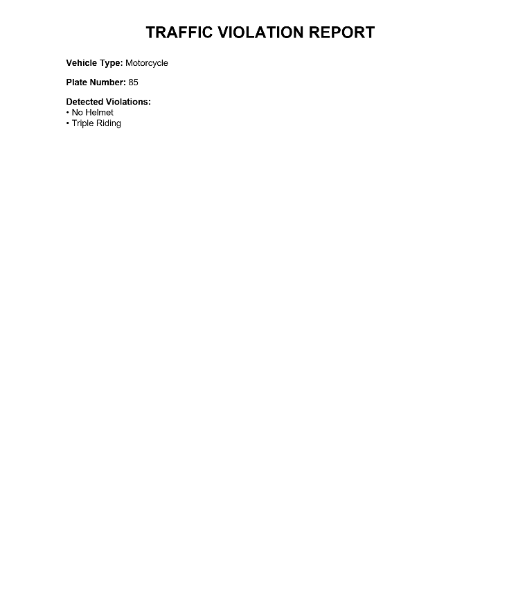

# AI-Powered Traffic Violation Analytics System


## Overview

AI-Powered Traffic Violation Analytics System is a computer vision-based solution designed to automatically detect traffic violations from road images using YOLOv8 object detection models and OCR techniques.

The system identifies multiple traffic violations, localizes vehicle number plates, extracts plate information using OCR, and automatically generates structured reports for further analysis.

---

## Features

### Traffic Violation Detection

* Helmet Violation Detection
* Triple Riding Detection
* Wrong-Side Driving Detection
* Illegal Parking Detection

### License Plate Analysis

* License Plate Localization using YOLOv8
* OCR-Based Number Plate Extraction using EasyOCR

### Automated Reporting

* Annotated Evidence Image Generation
* JSON Report Generation
* PDF Violation Report Generation

---

## System Architecture

Input Image

↓

YOLOv8 Detection Models

├── Rider Safety Detection

├── Wrong-Side Detection

├── Illegal Parking Detection

└── License Plate Detection

↓

Violation Analysis Engine

↓

OCR-Based Number Plate Extraction

↓

Evidence Generation

↓

JSON Report

↓

PDF Report

---

## Technologies Used

### Machine Learning & Computer Vision

* YOLOv8
* OpenCV
* EasyOCR

### Programming Language

* Python

### Reporting

* JSON
* ReportLab PDF Generation

---

## Models Used

| Model                         | Purpose                                    |
| ----------------------------- | ------------------------------------------ |
| Rider Safety Model            | Helmet Detection & Triple Riding Detection |
| Wrong-Side Detection Model    | Wrong Direction Vehicle Detection          |
| Illegal Parking Model         | Parking Violation Detection                |
| License Plate Detection Model | Number Plate Localization                  |

---

## Model Performance

| Model                         | mAP50 |
| ----------------------------- | ----- |
| License Plate Detection       | 96.5% |
| Wrong-Side Detection          | 96.1% |
| Illegal Parking Detection     | 87.7% |
| Red Light Violation Detection | 88.5% |
| Rider Safety Detection        | 73.6% |

---

## Sample Output

### Supported Violations

- No Helmet
- Triple Riding
- Wrong-Side Driving
- Illegal Parking

### Generated Outputs

* Annotated Evidence Image
* JSON Report
* PDF Violation Report

Refer to the `sample_outputs/` folder for example outputs.

---

## Output Screenshots

### Evidence Image



### JSON Report



### PDF Report



---

## Project Structure

```text
traffic-violation-analytics-system/

├── app.py
├── README.md
├── requirements.txt
├── models_info.md

├── docs/
│   ├── evidence_output.jpg
│   ├── json_output.png
│   └── pdf_output.png

├── sample_inputs/

├── sample_outputs/
│   ├── evidence.jpg
│   ├── result.json
│   └── Violation_Report.pdf

└── output/
```

---

## Usage

### Install Dependencies

```bash
pip install -r requirements.txt
```

### Run the Application

Analyze any image using:

```bash
python app.py <image_path>
```

Example:

```bash
python app.py sample_inputs/sample_motorcycle.jpg
```

### Generated Outputs

After execution, the system automatically generates:

* `output/evidence.jpg`
* `output/result.json`
* `output/Violation_Report.pdf`

---

## Example JSON Output

```json
{
  "vehicle_type": "Motorcycle",
  "violations": [
    "No Helmet",
    "Triple Riding"
  ],
  "plate_number": "Detected via OCR"
}
```

---

## Notes

* License plate localization is performed using a custom YOLOv8 model.
* OCR-based plate extraction is integrated using EasyOCR.
* OCR performance may vary depending on image quality, plate visibility, camera angle, lighting conditions, and motion blur.
* Triple Riding detection is derived from rider count analysis.


---

## Future Enhancements

* Real-Time CCTV Integration
* Video-Based Violation Detection
* Automatic Challan Generation

---

## Results

The system successfully performs:

* Multi-model traffic violation detection
* Automated license plate localization
* OCR-based plate extraction
* Evidence image generation
* Structured JSON report generation
* PDF violation report generation

---

## Author

Kashvi Dashore

B.Tech – Artificial Intelligence & Data Engineering

Indian Institute of Information Technology Kota (IIIT Kota)
